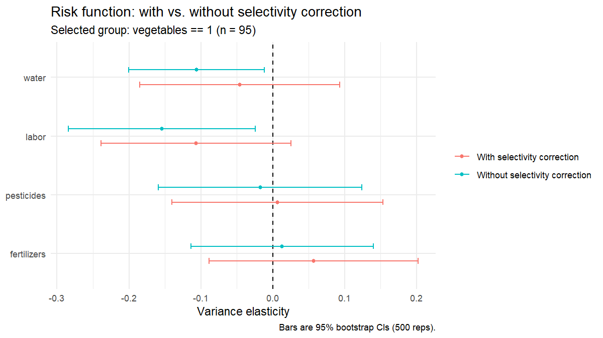

```{r, include = FALSE}
knitr::opts_chunk$set(collapse = TRUE, comment = "#>", eval = FALSE)
```

This vignette walks through the full JPselection pipeline on the built-in
synthetic dataset. The dataset roughly mimics the 239-farm Cyprus
sample in Table 1 of Koundouri & Nauges (2005); it is intended for
methodology demonstrations, **not** to reproduce the paper's exact
point estimates. To use real data, pass any data frame with the
appropriate columns to `jp_fit()`.

## Fit the model

```{r}
library(JPselection)

# Synthetic 239-farm dataset mimicking the paper's Cyprus sample
farms <- simulate_kiti_data(seed = 42)

fit <- jp_fit(
  data                 = farms,
  selection_var        = "vegetables",
  selection_covariates = c("rainfall", "irrigated", "dist_town",
                           "dist_coast", "experience"),
  output_var           = "revenue",
  input_vars           = c("fertilizers", "pesticides", "labor", "water"),
  shifter_vars         = c("machinery", "rainfall", "irrigated",
                           "dist_town", "dist_coast", "experience"),
  bootstrap_reps       = 500
)
```

## Inspect the results

Three methods are exposed on the `jpfit` object:

- `print(fit)` — risk-function table plus a plain-language
  interpretation.
- `summary(fit)` — every stage of the pipeline end-to-end.
- `plot(fit)` — headline coefficient plot with vs. without correction.

### `print(fit)`

```
Just-Pope production function with Heckman selection
Koundouri & Nauges (2005) three-step procedure
-------------------------------------------------------
  Selection equation : vegetables ~ rainfall + irrigated + dist_town + dist_coast + experience
  Output             : revenue
  Inputs             : fertilizers, pesticides, labor, water
  Sample             : 239 total, 95 selected (vegetables == 1)
  Bootstrap reps     : 500

Risk function coefficients (variance elasticities):
       Input Coef_with SE_with t_with Coef_without SE_without t_without
 fertilizers     0.057   0.074  0.766        0.013      0.065     0.202
  pesticides     0.007   0.075  0.089       -0.018      0.072    -0.242
       labor    -0.107   0.067 -1.588       -0.154      0.066    -2.331
       water    -0.046   0.071 -0.648       -0.106      0.048    -2.206

-------------------------------------------------------
Interpretation
-------------------------------------------------------
At p < 0.10, with selectivity correction:
  Risk-DECREASING inputs : (none)
  Risk-INCREASING inputs : (none)

Does selectivity correction change the conclusion?
  labor : significant without correction (p=0.022) but NOT significant once corrected (p=0.116)
  water : significant without correction (p=0.030) but NOT significant once corrected (p=0.519)

Selection-bias test (Mill's ratio in the mean function):
  coef = +0.527, p = 0.036 -- selection bias DETECTED.
  Prefer the 'with correction' column above.
```

### `summary(fit)`

`summary(fit)` prints all three stages of the procedure end-to-end:
the probit selection equation (Step 1), the linear-quadratic mean
production function with the Mill's ratio (Step 2), and the
with/without selectivity comparison for the risk function (Step 3).

```
======================================================================
Just-Pope production function with Heckman selection
Koundouri & Nauges (2005) three-step procedure
======================================================================

Selection variable : vegetables
Sample             : 95 selected of 239 (39.7%)
Bootstrap reps     : 500

----- STEP 1. Probit selection equation -----
    Variable Coefficient Std.Error Statistic p.Value Sig
 (Intercept)       0.618     0.674     0.917   0.359
    rainfall      -0.032     0.022    -1.419   0.156
   irrigated       0.014     0.004     3.866   0.000 ***
   dist_town       0.024     0.018     1.362   0.173
  dist_coast      -0.057     0.023    -2.437   0.015  **
  experience      -0.019     0.007    -2.664   0.008 ***

----- STEP 2. Mean production function (WITH selectivity) -----
Adjusted R-squared: 0.964
               Variable Coefficient Std.Error Statistic p.Value Sig
            (Intercept)       0.137     0.124     1.103   0.274
            fertilizers       0.013     0.016     0.818   0.416
             pesticides       0.036     0.012     3.043   0.003 ***
                  labor       0.042     0.011     3.684   0.000 ***
                  water       0.130     0.009    14.048   0.000 ***
       I(fertilizers^2)       0.002     0.001     1.277   0.206
        I(pesticides^2)       0.005     0.002     3.314   0.001 ***
             I(labor^2)      -0.000     0.002    -0.060   0.952
             I(water^2)       0.002     0.001     1.782   0.079   *
              machinery       0.069     0.011     6.453   0.000 ***
               rainfall      -0.199     0.125    -1.590   0.116
              irrigated       0.467     0.103     4.555   0.000 ***
              dist_town       0.184     0.045     4.115   0.000 ***
             dist_coast      -0.176     0.060    -2.944   0.004 ***
             experience      -0.211     0.068    -3.081   0.003 ***
         imr_vegetables       0.527     0.247     2.135   0.036  **
 fertilizers:pesticides       0.020     0.007     2.848   0.006 ***
      fertilizers:labor      -0.003     0.001    -2.319   0.023  **
      fertilizers:water      -0.005     0.004    -1.479   0.144
       pesticides:labor       0.001     0.003     0.407   0.685
       pesticides:water      -0.004     0.001    -3.163   0.002 ***
            labor:water       0.004     0.004     0.986   0.327

----- STEP 3. Risk function: with vs without selectivity -----
       Input Coef_with SE_with t_with Coef_without SE_without t_without
 fertilizers     0.057   0.074  0.766        0.013      0.065     0.202
  pesticides     0.007   0.075  0.089       -0.018      0.072    -0.242
       labor    -0.107   0.067 -1.588       -0.154      0.066    -2.331
       water    -0.046   0.071 -0.648       -0.106      0.048    -2.206
```

`summary()` also appends the same interpretation block that
`print(fit)` shows at the bottom.

### `plot(fit)`



Each input appears twice, once estimated with the Heckman correction
(red) and once without (teal). When the two estimates disagree the
selectivity bias is visible at a glance: here, `labor` and `water` look
significantly risk-decreasing only in the uncorrected (teal)
specification, matching the headline finding of the paper.

## Export the results

```{r}
jp_export(fit, "results.xlsx")    # one workbook, 5 sheets
jp_export(fit, "results.tex")     # booktabs tables for a paper
jp_export(fit, "results_csv/")    # one CSV per table
```

## Reproducing the paper's tables

An example script that runs the full pipeline for both the vegetables
and cereals groups from the paper and saves coefficient plots to
`./figures/` ships with the package:

```{r}
source(system.file("examples", "replicate_koundouri_2005.R",
                   package = "JPselection"))
```
